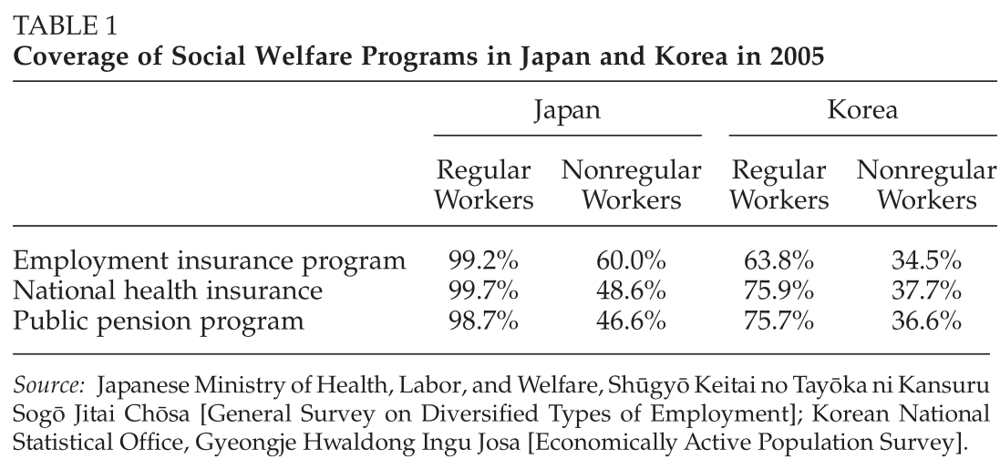

```{r setup, include=FALSE}
library(knitr)
library(here)
library(ymlthis)
library(tidyverse)
library(fontawesome)
library(readr)
library(ggthemes)
library(ggpubr)
library(RColorBrewer)
library(kableExtra)
library(data.table)
library(metathis)
library(xaringanthemer)
library(xaringanExtra)
library(data.table)
library(RefManageR)
library(plm)
library(mgcv)
library(mgcViz)
library(stargazer)
library(plotly)
library(htmlwidgets)
library(modelsummary)
```


```{r echo=FALSE}
options(htmltools.dir.version = FALSE)
knitr::opts_chunk$set(collapse = TRUE,
                      fig.retina = 3)
```


::: {.define .article style="color: blue;"}
[Song, J. (2012). Economic distress, labor market reforms, and dualism in Japan and Korea. *Governance, 25* (3), 415-438.](https://doi.org/10.1111/j.1468-0491.2012.01566.x)
:::

> Path-dependent trajectories of labor market and social protection reforms biased in favor of the interests of **labor market insiders** explain the rapid rise of **dualism** and inequality in the two countries.


## Intro

**VoC** framework: does not provide a sufficient explanation of the variations in labor market dualism and inequality within CMEs.

<span style="color:darkred">Japan</span>: conservative policymakers `r fa("arrows-alt-h", fill = "blue")` large firms `r fa("arrows-alt-h", fill = "blue")` core regular workers `r fa("arrow-alt-circle-right", fill = "#cc0033")` shielding labor market insiders from regulatory pressure + eroding regulations protecting outsiders for flexibility `r fa("arrow-alt-circle-right", fill = "#cc0033")` **dualism and inequality**

<span style="color:darkred">Korea</span>: strength of large **chaebol** unions `r fa("arrow-alt-circle-right", fill = "#cc0033")` obstructing the implementation of state’s labor reforms at the firm level `r fa("arrow-alt-circle-right", fill = "#cc0033")` labor market dualism and inequality


## Explaining labor market dualism and inequality in Japan and Korea

Both Japan & Korea: traditional absence of social-democratic parties `r fa("arrow-alt-circle-right", fill = "#cc0033")` weak explanatory power of "political" argument compared to EU

<span style="color:darkred">Japan</span>: 

 - liberalized temporary employment for non-regulars; 
 - decentralized wage bargaining;
 - consolidation of the dualistic welfare state

<span style="color:darkred">Korea</span>: 

 - policymakers & *chaebol* employers position: full-scale labor market reforms for insiders and outsiders + flexible labor markets;
 
 - large *chaebol* unions: fiercely opposed such reforms
 
 
## Insider-outsider differences

<span style="color:darkred">Japan's</span> labor policy: 

 - representing interests of **large firms** and their core **regular workers**;
 - deregulation of temporary employment -- **agency temps** (*haken shain*) and contract workers;
 - maintaining employment protection for insiders

Period of high growth: large Japanese firms promoted **skilled** non-regular workers to regular employment -- tight job security, wages & welfare benefits `r fa("arrow-alt-circle-right", fill = "#cc0033")` solving the problem of labor shortage

**1970s oil crises**:

 - layoffs for non-regular workers (mostly female part-time and temps workers);
 - protecting core regular male workers; 
 - share of non-regular workers -- 15-20\% till the late 1980s; 
 - most non-regulars: middle-aged **female part-timers**, secondary-income earners in families
 
 
**Worker Dispatch Law**:

 - 1986 legalized employers' rights to hire agency temps (*haken shain*) 
 - 1990 and 1996 revisions: occupational categories expanded to 16 and then to 26, but they were restricted to professionals (e.g., interpreters and software engineers);
 - 1999: "negative list system";
 - 2003: complete lifting of restrictions
 
Number of agency temps: 280,000 in 1999 `r fa("arrow-alt-circle-right", fill = "#cc0033")` 1,400,000 in 2008

**Global financial crisis**: 

 - agency temps in the manufacturing sector -- primary target of labor adjustment;
 - 207,381 workers laid off between October 2008 and June 2009;
 - \> 60\% of the laid-off workers: agency temps in the manufacturing sector
 
**In-house subcontracting**:

 - Electronics -- 53.9\%
 - Precision machinery -- 34.9\%
 
By 2010: 

 - \> 50\% of females and young workers -- non-regulars; 
 - \> 80\% of middle-aged male workers -- core regular workers

 
<span style="color:darkred">Korea</span>:

 - **1987 democratic transition** `r fa("arrow-alt-circle-right", fill = "#cc0033")` labor reform initiative;
 - chaebols & their unions: not accepting the state’s labor reform proposals for wage moderation;
 - president Kim Dae-jung in 1998: reforms to allow employers to lay off
redundant core regular workers `r fa("arrows-alt-h", fill = "blue")` improvement of workers' basic rights;
 - **chaebol unions**: blocked the initiative;
 - 2000: **Hyundai Motors** union -- pushed for regular workers' protection guarantees;
 - chaebols choice: increase in non-regular hiring + **subcontracting**;
 - SMEs' labor productivity vis-à-vis large firms: 40.3\% in 1996 `r fa("arrow-alt-circle-right", fill = "#cc0033")` 31.4\% in 2004;
 - automobile recovery `r fa("cart-arrow-down", fill = "#cc0033")` no increase in the hiring of regular workers;


## Firm-centered collective bargaining

In contrast to other CMEs, Japan and Korea: decentralized industrial relations based on **enterprise unions**

Union organization rates (1990-2008): 

 - Japan: 25.2\% `r fa("arrow-alt-circle-right", fill = "#cc0033")` 18.1\%;
 - Korea: 17.2\% `r fa("arrow-alt-circle-right", fill = "#cc0033")` 10.5\%

Inter-firm discrepancies (unionization rates): 

 - Japan: 45.3\% of firms with > 1,000 workers `r fa("arrows-alt-h", fill = "blue")` 1.1\% of firms with < 99 workers;
 - Korea: 45.4\% firms with > 300 workers `r fa("arrows-alt-h", fill = "blue")` 3.1\% of firms with < 99 workers


<span style="color:darkred">Japan</span>:

1975 *shunt&#333;*: business, labor, and government `r fa("arrow-alt-circle-right", fill = "#cc0033")` **political compromise**: employment protection `r fa("arrows-alt-h", fill = "blue")` wage restraints `r fa("arrows-alt-h", fill = "blue")` price stability

Number of **labor strikes**: peaked in 1974 `r fa("arrow-alt-circle-right", fill = "#cc0033")` **dramatically subsided** in late 1970s

Mid-1990s onward: SMEs not able to follow the guidelines for wage increases established by large labor unions `r fa("arrow-alt-circle-right", fill = "#cc0033")` wage increase differentials across firms became more salient

Most unions representing insiders: forced to accept a trade-off between **employment protection** and **wage restraints**

Increase in hiring non-regular workers `r fa("arrow-alt-circle-right", fill = "#cc0033")` weakened bargaining leverage for labor unions


<span style="color:darkred">Korea</span>:

**Democratization**: 

 - `r fa("arrow-alt-circle-right", fill = "#cc0033")` industrial disputes: 276 in 1986 `r fa("arrow-alt-circle-right", fill = "#cc0033")` 3,749 in 1987;
 - union organization rates: 13.8\% `r fa("arrow-alt-circle-right", fill = "#cc0033")` 17.8\%; 
 - distributional conflicts between *chaebols* and their unions
 
In contrast to Japan: **Korean state** took the primary role of coordinator in wage bargaining

*Chaebol* firms:
 - historically prioritized stabilization of industrial relations in their firms and workplaces `r fa("arrow-alt-circle-right", fill = "#cc0033")` buying industrial peace;
 - gave up the demand for high wages and generous corporate welfare benefits;
 - hiring of more non-regulars + subcontracting of production lines to SMEs `r fa("arrow-alt-circle-right", fill = "#cc0033")` controlling labor costs;
 
Post-1997 (**Asian financial crisis**):
 - few large competitive *chaebols* still capable of offering high wages to core regular workers under the protection of strong unions;
 - smaller *chaebols* and SMEs struggled to survive; 
 - industry federations (e.g., the financial and metal industries) `r fa("arrow-alt-circle-right", fill = "#cc0033")` attempt to lead industry-wide wage bargaining during the 2000s;
 - **<span style="color:white;background-color:black">however</span>**, enterprise unions in large competitive *chaebol* firms refused to join `r fa("arrow-alt-circle-right", fill = "#cc0033")` opted for more decentralized collective bargaining at the firm level
 

## Expansion and retrenchment of social protections

Japan & Korea: unable to effectively enhance social protections for labor market outsiders:

 - expansion of social protections for SME and non-regulars;
 - however, limited impact on the economic gap between **insiders and outsiders**
 
```{r echo=FALSE, include=TRUE, out.width = "100%", fig.align='center'}

```

Some social welfare reforms:

 - protections and benefits for core regular workers in large firms; 
 - persistence (or even widening) of gaps between insiders and outsiders;
 - intentionally reinforced the dualistic welfare regime
 
<span style="color:darkred">Japan</span>: 

1974 (immediately after the first oil crisis) -- **Employment Insurance Program**:

 - steady economic growth and low unemployment rates did not cause worries about unemployment and the sustainability of the program;
 - however, in 1990s: financial deficits of the Employment Insurance Program (especially in 1994) + rise of non-regulars `r fa("arrow-alt-circle-right", fill = "#cc0033")` concerns about the fiscal stability and extent of the program;
 - **voluntarily unemployed**: duration of insurance benefits shortened from 90-300 days to 90-180 days. 
 Mostly outsiders; 
 - **laid-off workers** (because of corporate bankruptcy and/or industrial restructuring): extended from 90-300 days to 90-330 days. 
 Mostly insiders
 
 
**Pensions**:

 - 1985 pension reform: **first retrenchment** of pension benefits since the establishment in 1961;
 - increased contribution premiums of the Employee’s Pension Insurance (*Kosei Nenkin Hoken*) for private sector workers from 10.6\% to 12.4\% `r fa("arrow-alt-circle-right", fill = "#cc0033")` tackling financial instability of the public pension system confronting pressure of an aging society;
 - reduced earning-related benefits by 5\%, raised contribution premiums for the Employee’s Pension Insurance;
 - began to shift the minimum age for pension insurance benefits from 60 to 65 years old;
 - firms’ introduction of "the wage peak system" `r fa("arrow-alt-circle-right", fill = "#cc0033")` restraining annual wage increases for older workers
 
**Non-regular employment**:

 - part-time workers: 25\% of the labor force by early 2000s, more than 2/3 of the non-regular workforce;
 - business and organized labor: strongly opposed government’s reform proposal to extend the Employees’ Pension Insurance to part-timers;
 - middle-aged women (part-timers' majority): also opposed the extension of the program coverage. 
 Reason: already covered by their husbands’ public pension programs `r fa("arrow-alt-circle-right", fill = "#cc0033")` preferred to keep the amount of the take-home pay without paying additional welfare contributions
 
<span style="color:darkred">Korea</span>: 

From 1987 onward: expansion of social welfare programs. 

Roh Tae-woo administration (1988-1992) launched the National Pension Program (*Kukmin Younkeum*) for firms with more than 10 workers in 1988 and expanded the **National Health Insurance** Program

1995 -- **Employment Insurance** Program: 

 - for firms with > 30 workers, SMEs and non-regulars;
 - insurance benefits: from 30-210 days to 90-240 days;
 - however, as of 2005, only 2/3 of the regulars and 1/3 of non-regulars covered

Kim Dae-jung administration (1998-2002): rapidly extended the coverage of the **National Pension** Program to the urban self-employed, informal urban workers, and SME workers.

However, pension reforms in 1998 **retrenched** insurance benefits, raised insurance premiums, and increased the age of pension.

2007 pension reform: 

 - reduced the level of **replacement ratio** from 60\% to 40\%;
 - failed to alleviate insider–outsider gaps.
 Non-regulars not qualified as “waged workers” `r fa("arrow-alt-circle-right", fill = "#cc0033")` employers not required to pay half of the premiums `r fa("arrow-alt-circle-right", fill = "#cc0033")` non-regulars would have to pay the entire contribution premiums `r fa("arrow-alt-circle-right", fill = "#cc0033")` non-regulars discouraged from enrolling in the National Pension Program;
 - discouraging or even blocking non-regulars from enrolling in the program `r fa("arrow-alt-circle-right", fill = "#cc0033")` favored core regular workers by protecting financial stability of the National Pension Program
 
After the 1997 financial crisis: economic gaps between regulars non-regulars **exacerbated** the expansion of the Employment Insurance Program and the National Pension Program


## Conclusions

 - labor market **insiders**: continued to enjoy strong employment protection, high wages, and generous welfare benefits even after labor market and social protection reforms; 

 - labor market **outsiders**: forced to absorb the costs of the business cycle and economic distress due to a high risk of job insecurity, low wages, and poor benefits
 
