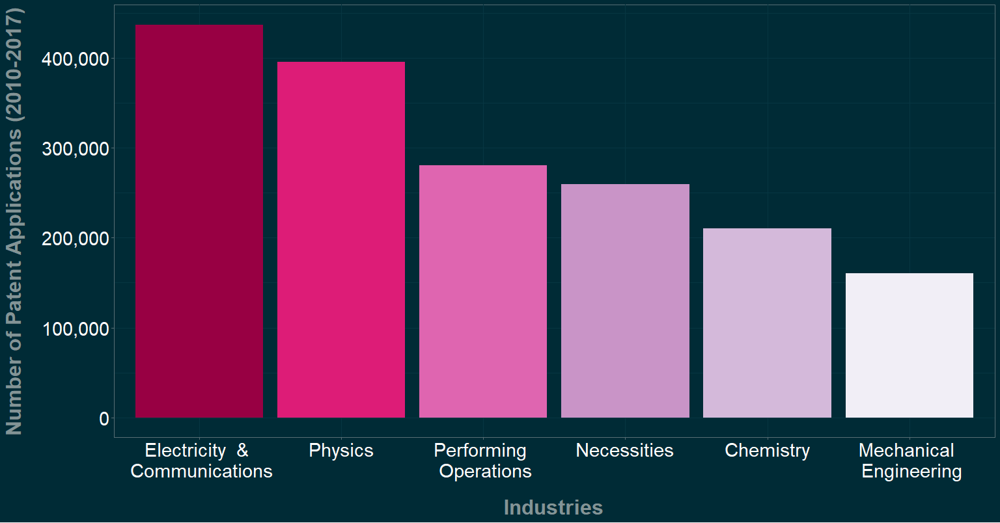
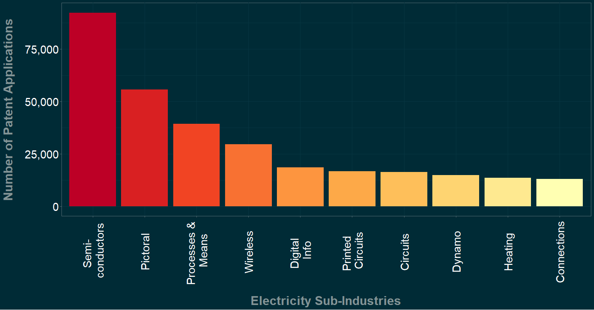
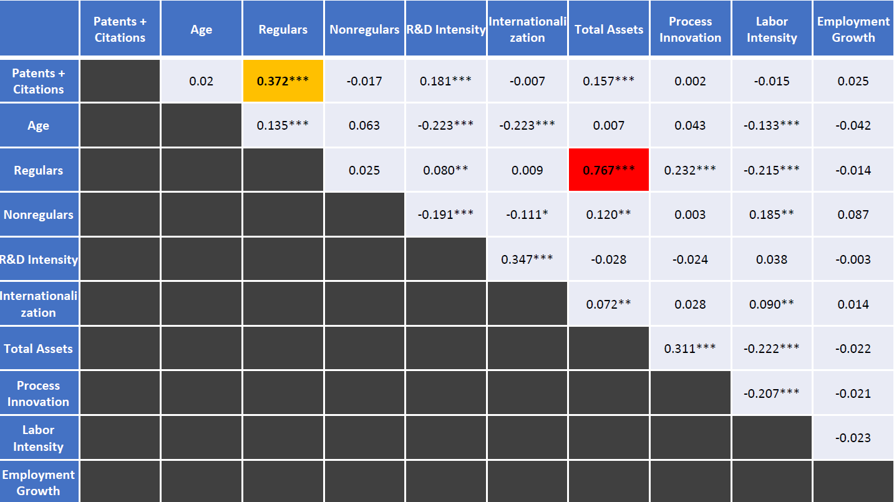
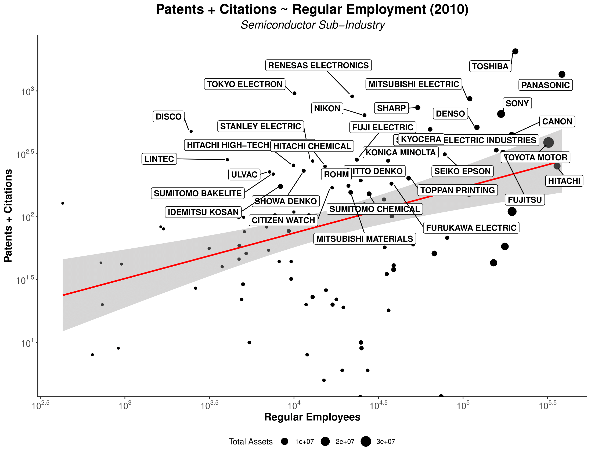
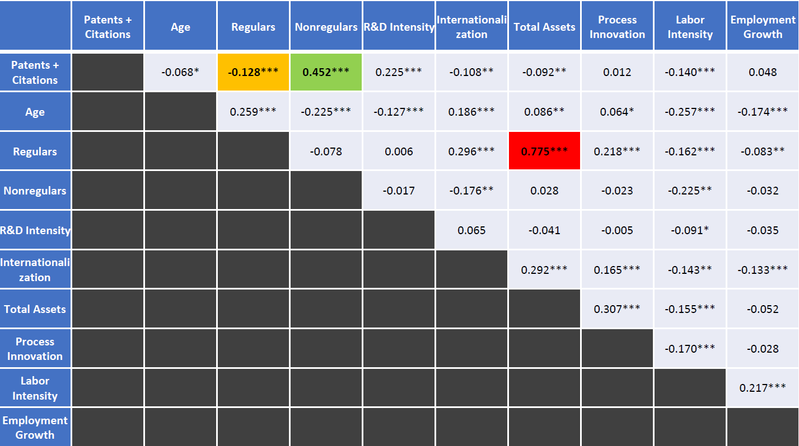
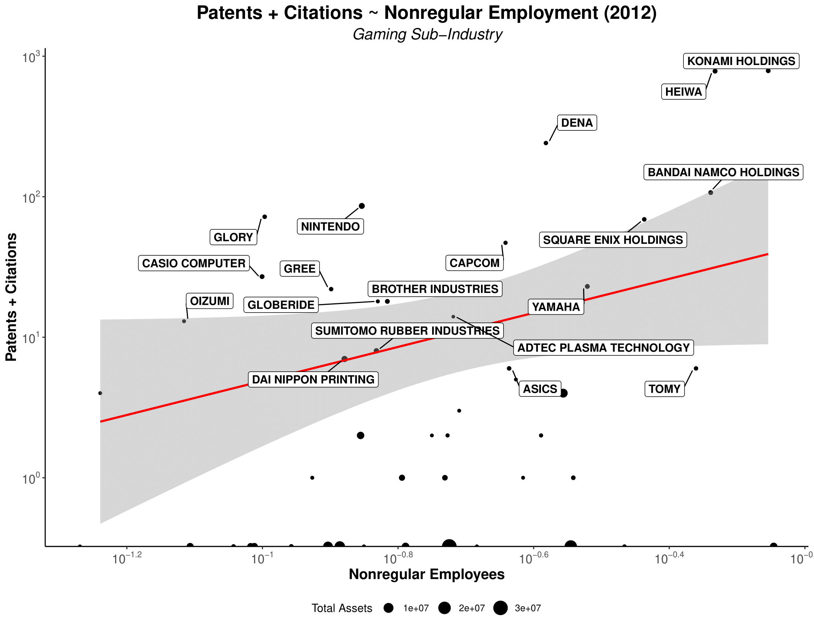
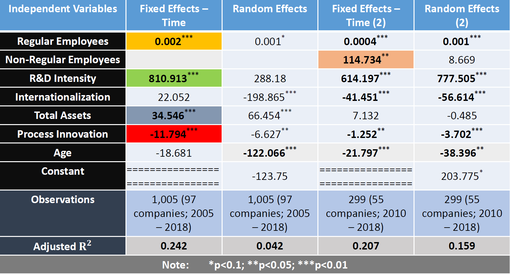
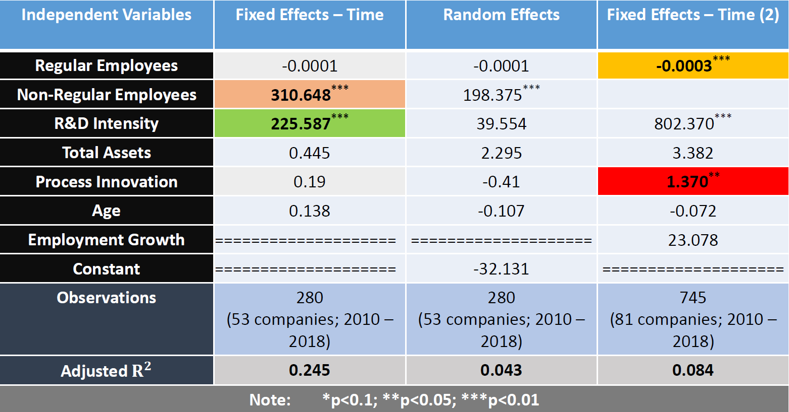

```{r setup, include=FALSE}
library(knitr)
library(summarytools)
library(here)
library(ymlthis)
library(tidyverse)

options(htmltools.dir.version = FALSE)
knitr::opts_chunk$set(collapse = TRUE,
                      fig.retina = 3)

```


name: title
class: title-slide middle left inverse
background-image: url("assets/img/Innovation.jpg")
background-position: bottom right
background-size: 400px

<!-- Title Slide -->


```{r title-slides, echo=FALSE, message = FALSE, warning = FALSE}
htmltools::withTags(
  div(
    class = "talk-meta",
    div(
      class = "talk-title",
      h1(rmarkdown::metadata$title),
      p(rmarkdown::metadata$subtitle)
    ),
    div(
      class = "talk-author",
      paste(rmarkdown::metadata$author, collapse = " <br> "),
      br(),
      span(paste(rmarkdown::metadata$institute, collapse = ", "))
    ),
    div(
      class = "talk-date",
      knitr::knit(text = rmarkdown::metadata$date, quiet = TRUE)
    )
  )
)
```


```{r xaringan-themer, include=FALSE, warning=FALSE}
library(xaringanthemer)
style_solarized_light()
```

```{r share-again, echo=FALSE}
xaringanExtra::use_share_again()
```

```{r style-share-again, echo=FALSE}
library(xaringanExtra)
xaringanExtra::style_share_again(
  foreground = "white",
  background = "black",
  share_buttons = c("twitter", "linkedin", "facebook")
)
```


```{r metathis, echo=FALSE}
library(metathis)
meta() %>%
  meta_name("github-repo" = "ko-suta/Academic-Website") %>% 
  meta_social(
    title = "The Role of Labor Flexibility in the Pursuit of Innovation Strategies by Established Japanese Companies.",
    description = paste(
      "[Non-] Regular employment & Corporate innovations.",
      "Presented at 2019 SASE Annual Meeting."
    ),
    url = "https://kovsiannikov.com/slides/sase-2019/sase-2019",
    image = "https://kovsiannikov.com/images/share-card.png",
    image_alt = "2019 SASE Annual Meeting Presentation",
    og_type = "website",
    og_author = "Kostiantyn Ovsiannikov",
    twitter_card_type = "summary_large_image",
    twitter_creator = "@ko_suta"
  )
```


???


Image credit: [Unsplash](https://unsplash.com/photos/r9mFb7HyddA)

---

## Does labor flexibility benefit innovation?

--

.pull-left[
* **Merits** 
  + Easier reallocation to more dynamic sectors
  + More incentives to take risks
  + Job matches 🢂 productivity
  + "Fresh blood" inflow
]

--

.pull-right[
* **Demerits**
  + Stronger labor protection 🢂 higher wages and productivity
  + Development of firm-specific skills
  + Trust 🢂 productivity
  + Innovation requires long-term incentives, not short-term punishments (Kleinknecht et al., 2014)
]

---

## Focus & Literature gap 

--

* Focus on **numerical labor flexibility**
  + "addresses the variation of quantity of labor input" (Arvantis, 2005),
  + reflects the ability of firms to use the external labor market to replace regular employees and/or to use temporary employees on fixed-term and part-time contracts, often through temporary employment agencies? (Kato & Zhou, 2018).

--
  
* **Literature gap** 
  + previous studies on this topic have mostly concentrated on European cases. Only Kato & Zhou (2018) have recently conducted the study on Japan's startup companies 
  + Kato & Zhou (2018) innovation proxy is a dummy variable (yes/no), mine is the number of applications and citations 

---

## Distribution of patent applications across industries 

```{r industries, echo=FALSE, fig.align="center", out.width = "75%"}

```

---

## "Electricity" subindustries with most patent applications 

```{r electricity, echo=FALSE, fig.align="center", out.width = "75%"}

```

---

## "Necessities" subindustries with most patent applications  

```{r necessities, echo=FALSE, fig.align="center", out.width = "75%"}
knitr::include_graphics("assets/img/image3.png")
```

---

## Companies with highest numbers of patent applications 

--

.pull-left[
* **Electricity & Communications**
  + Panasonic: 15009
  + Toshiba: 14028
  + Mitsubishi Electric: 13219
  + Canon: 13165
  + Toyota Motor: 10150
  + Sharp: 8874
  + Fujitsu: 8075
  + Sony: 7530
]

--

.pull-right[
* **Necessities (incl. "Games")**
  + Sankyo : 9168
  + Sega Sammy Holdings : 3896
  + Universal Entertainment : 2886
  + Heiwa : 2434
  + Terumo: 2272
  + Fujishoji : 2253
  + Iseki: 1859
  + Unicharm : 1441
]

---

## Methodology 

--

* **(Sub-) Industries analyzed** 
  + Electricity and Communications 🢂 "Semiconductors" 
  + Necessities 🢂 "Games"

--

* **Sources:**
  + The Institute of Intellectual Property Patent Database (IIP-DB): patent application data. Companies having > 5 applications (Lechevalier et al., 2010)
  + Nikkei NEEDS Financial Database: corporate data

--

* **Innovation proxy (dependent variable)**
  + Patent applications: "represent the development of new and technically feasible devices" (Kato & Zhou, 2018) — `quantity aspect` 
  + Patent citations — `quality aspect` (Acharya, Baghai et al., 2010)

---

## Possible conceptualization 

--

* **Visible innovations** — overcoming commoditization along established lines. Value results from function.

--

* **Invisible innovations** (Kusunoki, 2006)
  + "Rather than boosting existing dimensions, it paints an entirely new picture of how, why, and to whom a new product or service should appeal" (ibid). `Value ~ function` is unclear 
  + "Once a company succeeds in establishing a new product concept, it is often able to produce powerful loyalty and brand effects that trump dimensional superiority" (ibid).
  + Importance of product-customer interaction

--

* Japan is relatively **weak** in knowledge-based industries. **Gaming** is as an exception (Aoyama & Izushi, 2003).

--

* Japan's **dual labor market** 🢂 possibility of transition from non-regular to regular employment is only 1.7 to 10.3 percent. **Gaming industry** as an exception (Casper & Storz, 2016).

---

class: middle center

```{r descriptive, echo=FALSE, fig.align="center", out.width = "40%"}
knitr::include_graphics("assets/img/image7.png")
```

---

## "Semiconductors" — Correlations  

```{r corsemicon, echo=FALSE, fig.align="center", out.width = "80%"}

```

---

class: middle center

```{r semiconpat, echo=FALSE, fig.align="center", out.width = "70%"}

```


---

## "Games" — Correlations  

```{r corgames, echo=FALSE, fig.align="center", out.width = "80%"}

```

---

class: middle center

```{r gamespat, echo=FALSE, fig.align="center", out.width = "70%"}

```

---

## Variables 🢂 Operationalization 

--

* `Process innovation`: Investment / Capital Stock (Brouwer & Kleinknecht, 1997; Sterlacchini, 1998; Fukao, Ikeuchi et al., 2017)

--

* `Internationalization`: Exports / Sales

--

* `R&D Intensity`: R&D / Sales

--

* `Labor Intensity`: Labor Costs / Fixed Assets


---

## "Semiconductors" regression

```{r semiconreg, echo=FALSE, fig.align="center", out.width = "80%"}

```

---

## "Games" regression

```{r gamesreg, echo=FALSE, fig.align="center", out.width = "80%"}

```

---

##  Tentative conclusions 

--

.pull-left[
* **Semiconductors**
  + Crucial role of `R&D` for innovation, which is linked to `Product Innovation` 🢂
  + Negative role of `Process Innovation` 🢂
  + `Regulars` (and, possibly, `Non-Regulars`) play an important role 🢀
  + 🢀 Positive impact of both **innovation output** (`Patents`) and **innovation input** (`R&D`) on employment
  + `Larger` and `younger` companies are more innovative
]

--

.pull-right[
* **Games**
  + Important role of `R&D` for innovation
  + Crucial role of numerical labor flexibility, measured as `Non-regulars' share`
  + Investment in fixed assets (🢂 `Process Innovation` ) — important for services 🢂
  + 🢂 Adjustment of `regulars`
  + 🢀 Negative impact of **innovation output** (`Patents`); positive impact of **innovation input** (`R&D`) on employment
]

---

##  Additional findings  

--

+ **Older**  manufacturing firms struggle to innovate

--

+ **Younger**  manufacturing firms employing **non-regulars** innovate more

--

+ **Internationalization** is associated with less innovation for manufacturing companies employing **non-regulars**

---

class: inverse, center, middle

#  Thank you for your attention!

