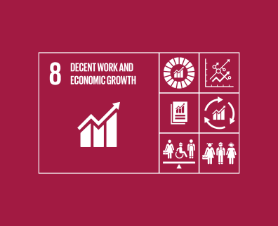
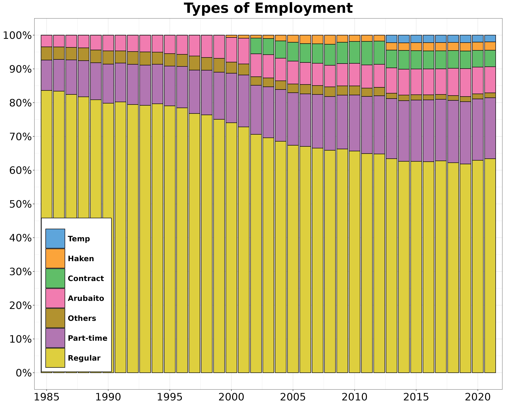
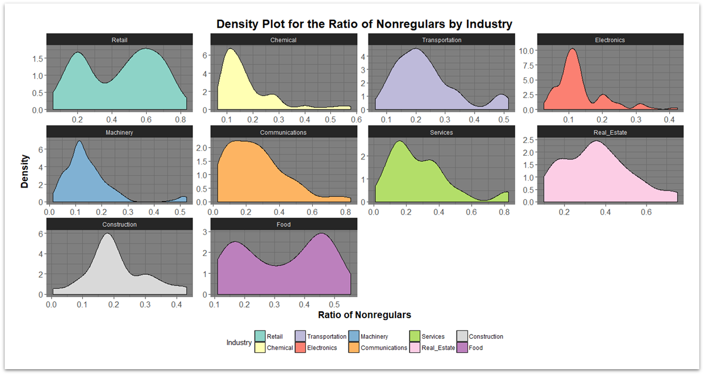

```{r setup, include=FALSE}
library(knitr)
library(summarytools)
library(here)
library(ymlthis)
library(tidyverse)
library(fontawesome)
library(readr)
library(ggthemes)
library(ggpubr)
library(RColorBrewer)
library(kableExtra)
library(data.table)
library(metathis)
library(xaringanthemer)
library(xaringanExtra)
library(data.table)
library(RefManageR)
library(plm)
library(mgcv)
library(mgcViz)
library(stargazer)
library(plotly)
library(htmlwidgets)
library(modelsummary)

options(htmltools.dir.version = FALSE)
knitr::opts_chunk$set(collapse = TRUE,
                      fig.retina = 3)

```


```{r, load_refs, include=FALSE, cache=FALSE}

BibOptions(check.entries = FALSE,
           bib.style = "authoryear",
           cite.style = "alphabetic",
           style = "markdown",
           hyperlink = FALSE,
           dashed = FALSE)
myBib <- ReadBib(here("slides", "Dual-Market-OECD", "Labor-Dualism.bib"), check = FALSE)
```


```{r xaringan-extra, echo=FALSE}
 
xaringanExtra::use_scribble()
xaringanExtra::use_tile_view()
xaringanExtra::use_tachyons()
xaringanExtra::use_panelset()
xaringanExtra::use_share_again()
xaringanExtra::use_broadcast()
xaringanExtra::use_search(show_icon = TRUE)

xaringanExtra::style_share_again(
  foreground = "white",
  background = "black",
  share_buttons = c("twitter", "linkedin", "facebook")
)

xaringanExtra::use_logo(
  width = "220px",
  height = "256px",
  position = xaringanExtra::css_position(top = "2em", right = "2em"),
  image_url = "assets/img/KUT.jpg",
  exclude_class = "hide_logo"
)

xaringanExtra::use_extra_styles(
  hover_code_line = TRUE,         #<<
  mute_unhighlighted_code = TRUE  #<<
)

xaringanExtra::use_progress_bar(
  color = "#0051BA", 
  location = "top", 
  height = "10px"
  )
```


```{r metathis, echo=FALSE, include=FALSE}
meta() %>%
  meta_name("github-repo" = "ko-suta/academic-new") %>% 
  meta_social(
    title = "Market Valuation of Corporate Technological Assets: <br> The Case of Japan's Institutional Adaptability",
    description = paste(
      "Market Valuation of Corporate Technological Assets.",
      "Presented at 2021 SASE Conference."
    ),
    url = "https://kovsiannikov.com/slides/sase-2021/sase-2021",
    image = "https://kovsiannikov.com/img/Techno-screen.png",
    image_alt = "2021 SASE Conference Presentation",
    og_type = "website",
    og_author = "Kostiantyn Ovsiannikov",
    twitter_card_type = "summary_large_image",
    twitter_creator = "@kovsiann"
  ) %>%
  include_meta()
```


# SDG 8

.pull-left[

- labor market <b>conditions</b>


- deficits of decent work <b>opportunities</b>


- poverty eradication `r fa("arrows-alt-h", fill = "blue")` full and productive employment `r fa("arrows-alt-h", fill = "blue")` decent work for all


- <b>youth</b> employment


- <b>remunerative</b> employment and productive occupational opportunities


- employment for <b>vulnerable groups</b>: women, urban poor, unemployed rural labour, low-income urban residents

]

.pull.right[


```{r sdg, echo=FALSE, fig.align="center", out.width = "40%"}

```

]

---

#  Varieties of Capitalism Framework 


.pull-left[
.white.bg-black[Liberal market economies (LMEs)]: .blue[U.S. & U.K.]

  <br>

  - profitability, 
  
  <br>
  
  - higher sensitivity to market valuation,
  
  <br>

  - relatively short-term commitments (motivated by competitive concerns)
]

--

.pull-right[
.white.bg-black[Coordinated market economies (CMEs)]: .blue[Japan, Germany, France]

  - long-term commitments,
  
  <br>

  - relational banking,
  
  <br>

  - governmental oversight
]

---

#  Labor Dualism Phenomenon 

--

- .white.bg-black[LMEs]: deregulating working arrangements both for regular and non-regular employees

--

<br>

- .white.bg-black[CMEs]: loosening employment guarantees for temporary employees, while keeping social guarantees for core employees


---

#  Insider/Outsider Theory (by David Rueda) 

--

- .white.bg-black[Social democracy] + <b>trade unions</b>: only represent the interests of labor market <b>insiders</b> (i.e. regular employees)

--

<br>

- <b>Insiders</b>: interested in job protection  🢂 voting for Social Democrats

--

<br>

- <b>Outsiders</b> (unemployed & part-time workers): oppose social-democratic regulations


---

#  Critique of Insider/Outsider Division 

--

- Reducing humans to .white.bg-black[homo economicus] 🢂 exaggerating insider/outsider differences. 
Realistically, they may become blurred in the long run, because everyone has interest in employment protection.

--

<br>

- If <b>outsiders</b> had opposed Social Democrats, what would be the viable political alternative?

--

<br>

- Because of the household relationships, <b>outsiders</b> are also likely to support labor market regulations `r Citep(myBib, "emmenegger2009joesp", .opts = list(cite.style = "authoryear", style = "html"))`


---

#  Critique continued 

--

- Had the labor dualism been reinforced by Social Democrats, the sharpest divide would be observed in Scandinavian countries

--

<br>

- However, in Europe, labor dualism is most pronounced in France and Germany, where Social Democrats are weaker than in Scandinavia `r Citep(myBib, "palier2010", .opts = list(cite.style = "authoryear", style = "html"))` 


---

#  Asseessing Labor Dualism  

--

.pull-left[
.white.bg-black[Varieties of Capitalism]

  - protection of regular employees in CMEs is a *stabilizing* factor against the common neoliberal deregulation
]

--

.pull-right[
.white.bg-black[Political Economy of institutions]

  
  - labor dualism is an entrenched tradeoff maintained by managers and political elites to contain and to 'silence' workers
  
  <br>

  - cooperation between management and regular workers  🢂 *destabilizing* effect `r Citep(myBib, "thelen2006g", .opts = list(cite.style = "authoryear", style = "html"))`; gradual erosion of the industrial relations system `r Citep(myBib, "palier2010", .opts = list(cite.style = "authoryear", style = "html"))`
]


---

#  Non-Regular Employment: Definitions 

--

- Standard (<b>regular</b>) employment: full-time & indefinite

--

<br>

- ILO Part-Time Work Convention (1994): "A <b>part-time</b> worker is an employed person whose normal hours of work are less than those of comparable full-time workers"

--

<br>

- For statistical purposes: part-time work is <b>< 35 (30)</b> hours per week

--

<br>

- `De-jure` definitions are problematic when dealing with specific institutional context (e.g. <b>Japanese</b>)


---
#  What underpins labor dualism? 

--

- Collective bargaining rights (hence, union membership) is prevailing in industrial sector, but is uncommon for services

--

<br>

- Thus, services account for highest proportion of temporary workers

--

<br>

<ru-blockquote>Employers like to divide the labour market into the internal and external markets, since they want a buffer against the fluctuation and uncertainty of product demand and since they need to restrict the number and power of internal workers in order to suppress wage costs and need to maintain the flexibility of labour management"  `r Citep(myBib, "ishikawa2001b", .opts = list(cite.style = "authoryear", style = "html"))`</ru-blockquote>

--

<ru-blockquote>"Employment protection for insiders remained relatively unchanged in Japan even after labor market reforms, whereas outsiders were exposed to a much higher risk of unemployment, low wages, and poor welfare benefits" `r Citep(myBib, "song2012g", .opts = list(cite.style = "authoryear", style = "html"))`</ru-blockquote>


---

#  Causes of Labor Dualism in Japan 

--

- Post-bubble strategy of limiting the hiring of regular workers Regulars = long-term contracts + social benefits, Lower proportion of core workforce  🢂 **curbing average labor costs** during economic downturns

--

<br>

- "Sharp **contraction of self-employment and family labor**, a rise in the numbers of the elderly seeking work, and the increase of job-seeking women previously not in the wage labor force" `r Citep(myBib, "gordon2017ssjj", .opts = list(cite.style = "authoryear", style = "html"))`. 

--

<br>

- **Negative externality of the departure from the stakeholder model** of corporate governance. While this model has not been completely abandoned, non-regular employees appear as *outsiders* whose interests are put in jeopardy in order to maintain the protection of *insiders* that include regular employees.


---

#  Continuation 

--


- "In Japan, political coalitions between conservative policymakers, large firms, and core regular workers were the driving force of the reinforcement of dualism and inequality by shielding labor market insiders from the pressure for regulatory reforms but extensively eroding regulations protecting outsiders for flexibility" `r Citep(myBib, "song2012g", .opts = list(cite.style = "authoryear", style = "html"))`.

--

<br>

- Flexibilization of labor is not a problem *per se*, if it exists in the environment with low labor turnover costs and representative unions, as in Nordic countries `r Citep(myBib, "song2012g", .opts = list(cite.style = "authoryear", style = "html"))`.

--

<br>

- "Non-regular employment [in Japan] does not play a role of a steppingstone to move toward better jobs like regular employment, but that of a 'dead-end' trap" `r Citep(myBib, "witt2016jibs", .opts = list(cite.style = "authoryear", style = "html"))`.


---

```{r nonreg, echo=FALSE, fig.align="center", out.width = "80%"}

```


---

```{r nonreg-ind, echo=FALSE, fig.align="center", out.width = "80%"}

```

---

#  Estimated Unionization Rate 


```{r unions, echo=FALSE, fig.align="center", out.width = "60%"}
knitr::include_graphics("assets/img/unions.png")
```

.footnote[Basic Survey on Labour Unions (2015), as cited in Ministry of Health, Labour and Welfare (2015, p. 16) ]

---

#  International Comparisons 

--

- Currently, proportion of non-regular employees is almost **40%**, their chances of switching to regular employment are **1.7 ~ 10.3 %** compared to 30% in the UK and 45% in Germany `r Citep(myBib, "aoyagi2015labor", .opts = list(cite.style = "authoryear", style = "html"))` 🢂 labor bifurcation

--

<br>

- In Japan "non-regular workers are paid only 56.8% of what regular employees earn on average as compared with 89.1% in France, 79.3% in Germany and 70.8% in Britain" (Japan Times, 2016).

---

# References

```{r refs, echo=FALSE, results="asis"}
PrintBibliography(myBib)
```
---

class: inverse, center, middle

#  Thank you for your attention!
